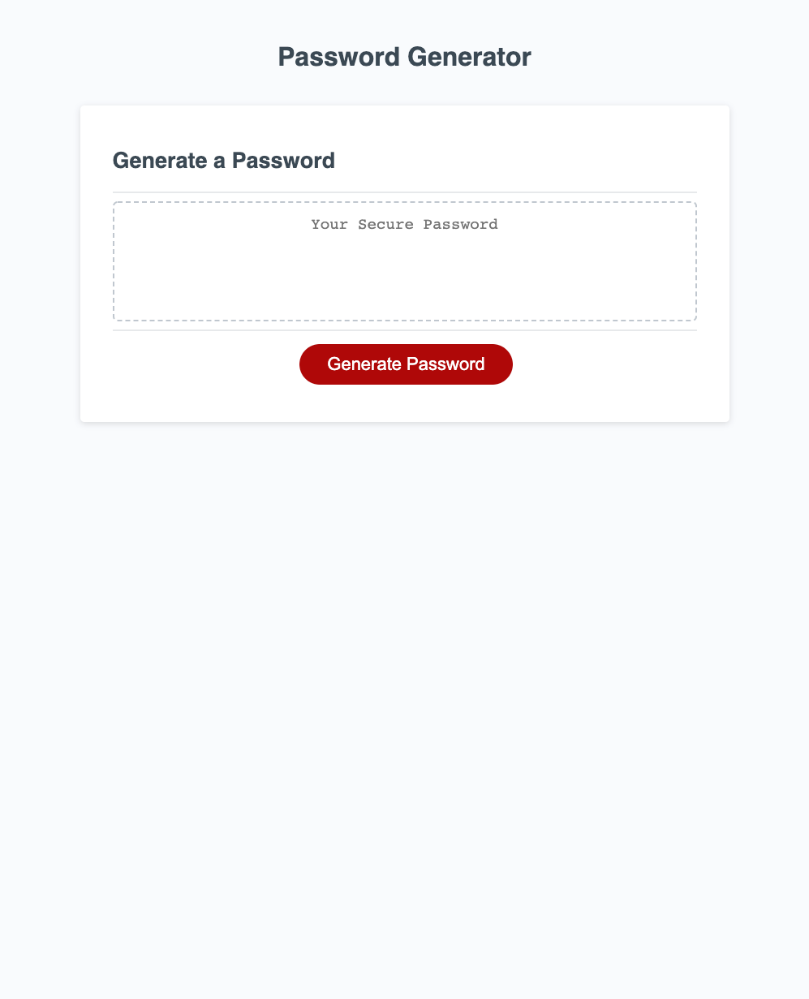

# Challenge 03 JavaScript: Password Generator

## Description
This application will create a random password based on user input. 

**FEATURES INCLUDE:**
 * When the button is clicked to generate a password, the user will be presented with a series of prompts for password criteria.
 * The user will then select which criteria they want in the password.
 * The user will first be prompted to select the length of the password. 
 * A length between 8 - 128 must be chosen or an alert will pop up prompting them to start over.
 * Next, the user will confirm whether or not to include uppercase, lowercase, numberic and/or special characters.
 * If none of the prompts are confirmed, an alert message will prompt the user saying at least one prompt needs to be selected.
 * If one or more prompts are selected, then a password is generated that matches the selected criteria.
 * The password will be written to the page.

## Website Link
[Click Here](https://mich-hales.github.io/module-03-challenge/Develop/index.html) to try out the password generator!

## Repository Link
[Click Here](https://github.com/mich-hales/module-03-challenge) to view the repository.

## Mock-Up
Here is a screenshot of the web application.

